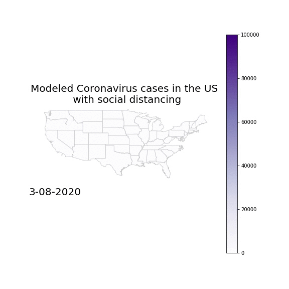

# STAYATHOME

## Importance of Social Distancing

Recently (as of 4-26-2020), protests have sprung up through the United States denouncing government regulations like shelter in place. However, it is still too early to re-open the US -- social distancing measures flattened the curve dramatically and continue to do so. I visualized the spread of the coronavirus over the past two months, and used that to create a model that predicted the spread of cases within the United States without social distancing. Here are the results:

 
