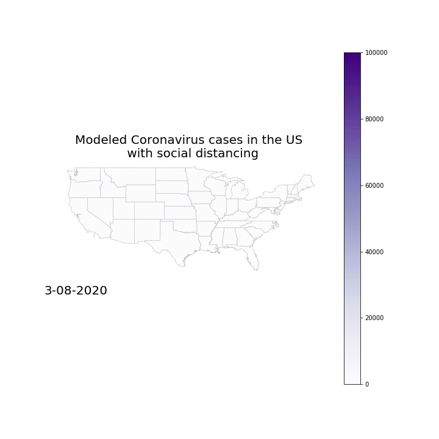

# STAYATHOME

## Importance of Social Distancing

Recently (as of 4-26-2020), protests have sprung up through the United States denouncing government regulations like shelter in place. However, it is still too early to re-open the US -- social distancing measures flattened the curve dramatically and continue to do so. I visualized the spread of the coronavirus over the past two months, and used that to create a model that predicted the spread of cases within the United States without social distancing. Here are the results:

 

### Data

#### Social Distancing Data

This data was obtained through Safegraph's [social distancing dataset](https://docs.safegraph.com/docs/social-distancing-metrics), which helps researchers understand peoples' movements as a result of the coronavirus. It's generated with a series of GPS ping to anonymous mobile devices, whose nighttime location is the "home". For the purpose of this project, I used "device_count" (number of devices in a given area, roughly estimating the total number of people in an area) and "completely_home_device_count" (the devices which did not leave their home during the given time period). This gave me a rough percentage of the number of people following quarantine procedures in each state. I then estimated 85-90% of these people usually go outside, involving them in my SEIR model (mentioned below).

#### Coronavirus Cases Data

As testing is hard to come by, I had to resort to grouping by state when identifying total confirmed coronavirus cases, instead of by census block as I originally planned. This data was extracted from a [Coronavirus API](http://coronavirusapi.com/).

### Modeling the Virus

To actually model the virus, I followed the methodology used in [this journal](https://www.thelancet.com/action/showPdf?pii=S2468-2667%2820%2930073-6). Although the authors based the work in Wuhan at the outbreak, the methods used transfer over to this scenario, but I was forced to change some numbers to more accurately model the spread.

I followed along with their SEIR model, dividing the population of each state into susceptible (S), exposed (E), infected (I), and removed/recovered (R) individuals. The formulas, with corresponding parameters, are as follows: 

 

I had to make some changes by bucketing the states by size. This allowed me to more accurately depict the virus (within reason as even coronavirus data is flawed due to lack of testing) since the spread in North Dakota will be different than the spread in New York.
